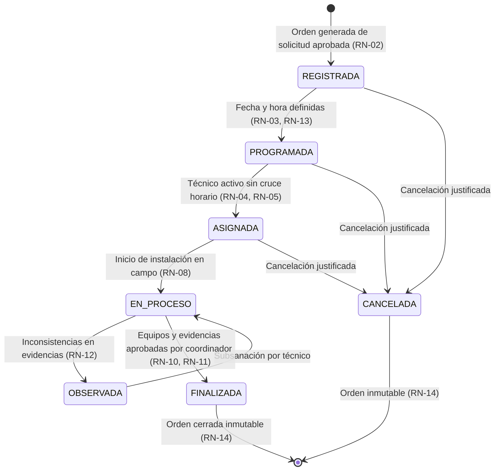

# 🌐 Sistema Web para la Gestión y Seguimiento de Instalación de Dispositivos de Red

> **Empresa:** FIBERPERU E.I.R.L. (RUC: 20514491187)  
> **Curso:** Curso Integrador II: Sistemas (UTP)  
> **Estado del Proyecto:** En Desarrollo (Agosto 2026 - Diciembre 2026)

---

## 📋 Tabla de Contenidos
1. [Descripción del Proyecto](#-descripción-del-proyecto)
2. [Problema y Oportunidad de Innovación](#-problema-y-oportunidad-de-innovación)
3. [Arquitectura y Stack Tecnológico](#-arquitectura-y-stack-tecnológico)
4. [Roles del Sistema](#-roles-del-sistema)
5. [Estructura del Repositorio](#-estructura-del-repositorio)
6. [Product Backlog](#-product-backlog)
7. [Requerimientos Funcionales (SRS)](#-requerimientos-funcionales-srs)
8. [Requerimientos No Funcionales](#-requerimientos-no-funcionales)
9. [Reglas de Negocio Implementadas](#-reglas-de-negocio-implementadas)
10. [Restricciones del Sistema](#-restricciones-del-sistema)
11. [Indicadores KPI y Acuerdos de Nivel de Servicio (SLA)](#-indicadores-kpi-y-acuerdos-de-nivel-de-servicio-sla)
12. [Planificación Ágil (Framework Scrum)](#-planificación-ágil-framework-scrum)
13. [Equipo de Desarrollo](#-equipo-de-desarrollo)

---

## 🚀 Descripción del Proyecto
El proyecto consiste en el desarrollo de un **sistema web integral** diseñado para optimizar los procesos de programación, asignación de técnicos, control de stock de dispositivos, seguimiento en tiempo real y cierre de órdenes de servicio de instalación de redes de fibra óptica y equipos de comunicaciones en **FIBERPERU E.I.R.L.**

La solución busca centralizar la trazabilidad operativa desde el momento en que se registra una solicitud de servicio por parte del cliente hasta la validación y conformidad final de las evidencias técnicas.

---

## 💡 Problema y Oportunidad de Innovación
* **El Problema:** La gestión descentralizada de solicitudes, la falta de visibilidad en tiempo real del estado de las órdenes, la duplicidad de información y las dificultades para consultar el historial de instalaciones afectan la eficiencia operativa y la supervisión de los servicios.
* **La Solución:** Una plataforma web centralizada que automatiza la asignación de personal técnico según su disponibilidad, controla el inventario mediante números de serie únicos, almacena evidencias multimedia y genera reportes para la toma de decisiones gerenciales.

---

## ⚙️ Arquitectura y Stack Tecnológico
El sistema ha sido estructurado bajo un modelo cliente-servidor robusto, seguro y escalable:

* **Backend:** Java 21, Spring Boot 3.3.4, Spring Data JPA, Hibernate, Spring Security, BCrypt y JSON Web Tokens (JWT).
* **Frontend:** Next.js / React, TypeScript, HTML5, CSS3, TailwindCSS.
* **Base de Datos:** PostgreSQL 16 (dockerizado en entorno local / Azure Database for PostgreSQL).
* **Control de Versiones:** Git y GitHub (`main`, `develop`, feature branches).
* **Integración Continua:** GitHub Actions (compilación Maven y ejecución de pruebas).
* **Entorno Cloud:** Microsoft Azure (Azure App Service, Azure Blob Storage).
* **Herramientas de Modelado:** Bizagi Modeler (BPMN), Draw.io (DER/UML), Figma (Wireframes/Mockups), Postman.

---

## 👥 Roles del Sistema
El acceso a las funcionalidades del sistema está protegido mediante control de acceso basado en roles (RBAC):
1. **Administrador:** Responsable de la gestión de usuarios, roles, permisos, clientes, técnicos, catálogo de dispositivos y visualización de reportes / KPIs globales.
2. **Coordinador de Instalaciones:** Responsable de la recepción y evaluación de solicitudes, generación de órdenes de trabajo (OT), programación de fechas, asignación de técnicos, validación de evidencias técnicas y cierre formal de órdenes.
3. **Técnico Instalador:** Responsable de consultar sus órdenes asignadas, reportar traslados e inicio de trabajos, registrar números de serie de dispositivos instalados, subir evidencias multimedia y reportar observaciones de campo.
4. **Cliente Solicitante:** Registro de solicitudes de instalación y consulta de avance en tiempo real mediante código/ticket.

---

## 📂 Estructura del Repositorio
El repositorio se encuentra organizado de la siguiente manera para mantener un código limpio y mantenible:

```text
fiberperu-instalaciones/
│
├── Backend/                 # API REST desarrollada en Java 21 / Spring Boot
│   ├── src/main/java/com/fiberperu/demo/
│   │   ├── config/          # Seguridad Spring Security, JWT, CORS, Auditing
│   │   ├── controller/      # Endpoints REST (14 controladores)
│   │   ├── dto/             # Data Transfer Objects para requests y responses
│   │   ├── entity/          # Entidades JPA (Usuario, Cliente, OrdenTrabajo, etc.)
│   │   ├── repository/      # Repositorios Spring Data JPA con queries personalizadas
│   │   ├── service/         # Lógica y Reglas de Negocio (Service Layer)
│   │   └── exception/       # Manejo global de excepciones
│   └── pom.xml              # Dependencias Maven (Lombok, JWT, PostgreSQL, Validation)
├── frontend/                # Interfaz de usuario Next.js / React
│   ├── app/                 # Páginas, layout y componentes interactivos
│   └── services/            # Cliente HTTP Axios / Fetch hacia la API REST
├── database/                # Scripts SQL (01_schema.sql, 02_seeds.sql, 03_demo_data.sql)
├── documentacion/           # Especificación SRS, Project Charter, diagramas
├── diagramas/               # Diagramas BPMN, conceptuales, lógicos y UML
├── .gitignore               # Archivos ignorados por Git
└── README.md                # Documentación principal del proyecto
```

---

## 🎯 Product Backlog

El Product Backlog agrupa las historias de usuario organizadas por módulo y prioridad para dar soporte integral a la operación de FIBERPERU E.I.R.L.:

| ID | Historia de Usuario | Módulo | Prioridad | Estado de Implementación |
| :---: | :--- | :---: | :---: | :---: |
| **PB-01** | Como Administrador, quiero iniciar sesión de forma segura y gestionar roles para controlar el acceso de los usuarios al sistema. | Seguridad y Auth | Alta | ✅ **Implementado** (Spring Security + JWT + BCrypt) |
| **PB-02** | Como Administrador, quiero registrar y administrar los datos de los clientes para mantener organizada la cartera. | Clientes | Alta | ✅ **Implementado** (`ClienteController` / `ClienteService`) |
| **PB-03** | Como Coordinador, quiero registrar solicitudes de instalación para clientes nuevos, iniciando el ciclo de atención. | Solicitudes | Alta | ✅ **Implementado** (`SolicitudInstalacionController`) |
| **PB-04** | Como Coordinador, quiero generar una orden de trabajo a partir de una solicitud aprobada para gestionar el servicio. | Órdenes (Coordinación) | Alta | ✅ **Implementado** (`POST /api/ordenes/generar/{id}`) |
| **PB-05** | Como Administrador, quiero registrar el catálogo de dispositivos de red (marca, modelo, serie) para controlar los equipos disponibles. | Inventario / Equipos | Alta | ✅ **Implementado** (`DispositivoController`, `TipoDispositivoController`) |
| **PB-06** | Como Coordinador, quiero agendar fechas y asignar técnicos disponibles a una orden, evitando cruces de horarios. | Programación | Alta | ✅ **Implementado** (Validación cruce horarios en `OrdenTrabajoService`) |
| **PB-07** | Como Técnico Instalador, quiero consultar la lista detallada de mis instalaciones asignadas para organizar mi día de trabajo. | Órdenes (Técnico) | Alta | ✅ **Implementado** (`GET /api/ordenes/mis-ordenes`) |
| **PB-08** | Como Técnico Instalador, quiero subir fotografías y documentos como evidencia del servicio terminado directamente desde el campo. | Evidencias | Alta | ✅ **Implementado** (`EvidenciaInstalacionController` multipart/file) |
| **PB-09** | Como Técnico Instalador, quiero actualizar el estado de una orden (ej. En proceso, Finalizada) para informar el avance en tiempo real. | Seguimiento | Media | ✅ **Implementado** (`PATCH /api/ordenes/{id}/estado`) |
| **PB-10** | Como Técnico Instalador, quiero vincular los números de serie de los dispositivos físicos que instalé a la orden de trabajo actual. | Instalación | Media | ✅ **Implementado** (`OrdenDispositivoController`) |
| **PB-11** | Como Coordinador, quiero aprobar o rechazar (observar) las evidencias enviadas por los técnicos antes de cerrar formalmente una orden. | Validación y Cierre | Media | ✅ **Implementado** (`EvidenciaInstalacionService.evaluarEvidencia`) |
| **PB-12** | Como Coordinador, quiero consultar el historial completo de instalaciones realizadas para mantener la trazabilidad operativa. | Trazabilidad | Media | ✅ **Implementado** (`HistorialOrdenController` + auditoría JPA) |
| **PB-13** | Como Administrador, quiero visualizar un dashboard y generar reportes con KPIs operativos para supervisar el desempeño general. | Reportes | Media | 🟡 **Frontend en integración** (Métricas base calculadas en API) |
| **PB-14** | Como Cliente, quiero consultar el estado de avance de mis solicitudes desde mi cuenta para realizar seguimiento al servicio. | Seguimiento Cliente | Baja | ✅ **Implementado** (`SeguimientoPublicoController`) |

---

## ⚙️ Requerimientos Funcionales (SRS)

A continuación se detalla la matriz de requerimientos funcionales del sistema conforme a la Especificación de Requerimientos de Software (SRS), vinculando su estado de implementación en el backend y frontend:

| Código | Requerimiento Funcional | Rol Asociado | Módulo Backend | Estado |
| :---: | :--- | :---: | :---: | :---: |
| **RF-01** | Inicio y cierre de sesión mediante credenciales de acceso (correo/usuario y contraseña). | Todos | `AuthController` | ✅ Implementado |
| **RF-02** | Registrar, consultar, actualizar y desactivar usuarios del sistema. | Administrador | `UsuarioController` | ✅ Implementado |
| **RF-03** | Gestionar roles (ADMINISTRADOR, COORDINADOR, TECNICO, CLIENTE) y sus permisos por perfil. | Administrador | `UsuarioController` / `SecurityConfig` | ✅ Implementado |
| **RF-04** | Registrar, consultar, actualizar y desactivar perfiles de clientes. | Administrador / Coordinador | `ClienteController` | ✅ Implementado |
| **RF-05** | Registrar, consultar, actualizar y definir la disponibilidad activa de técnicos instaladores. | Administrador / Coordinador | `TecnicoController` | ✅ Implementado |
| **RF-06** | Registrar y gestionar el catálogo y stock de dispositivos de red (marca, modelo, tipo, número de serie). | Administrador | `DispositivoController` / `TipoDispositivoController` | ✅ Implementado |
| **RF-07** | Registrar solicitudes de instalación asociando tipo de servicio y cliente. | Cliente / Coordinador | `SolicitudInstalacionController` | ✅ Implementado |
| **RF-08** | Consultar, aprobar o rechazar solicitudes de instalación evaluadas técnicamente. | Coordinador | `SolicitudInstalacionController` | ✅ Implementado |
| **RF-09** | Generar una orden de trabajo (OT) a partir de una solicitud aprobada. | Coordinador | `OrdenTrabajoController` | ✅ Implementado |
| **RF-10** | Programar fecha y hora estimada de instalación verificando el calendario operativo. | Coordinador | `OrdenTrabajoController` | ✅ Implementado |
| **RF-11** | Asignar técnico instalador a una orden de trabajo validando disponibilidad y previniendo cruce de horarios. | Coordinador | `OrdenTrabajoService.asignarTecnico` | ✅ Implementado |
| **RF-12** | Consultar listado y detalle de órdenes de instalación asignadas al técnico autenticado. | Técnico | `OrdenTrabajoController` (`/mis-ordenes`) | ✅ Implementado |
| **RF-13** | Actualizar estado de una orden durante su ciclo de vida (`PROGRAMADA`, `ASIGNADA`, `EN_PROCESO`, `OBSERVADA`, `FINALIZADA`). | Técnico / Coordinador | `OrdenTrabajoService.cambiarEstado` | ✅ Implementado |
| **RF-14** | Vincular números de serie de dispositivos físicos instalados a la orden de trabajo. | Técnico | `OrdenDispositivoController` | ✅ Implementado |
| **RF-15** | Registrar observaciones técnicas, anomalías y notas de campo del servicio. | Técnico / Coordinador | `ObservacionServicioController` | ✅ Implementado |
| **RF-16** | Adjuntar evidencias multimedia de la instalación (imágenes JPG, PNG y documentos PDF). | Técnico | `EvidenciaInstalacionController` | ✅ Implementado |
| **RF-17** | Revisar evidencias por parte del coordinador con capacidad de aprobar u observar para subsanación. | Coordinador | `EvidenciaInstalacionService` | ✅ Implementado |
| **RF-18** | Cerrar definitivamente una orden de trabajo cuando equipos y evidencias estén conformes. | Coordinador | `OrdenTrabajoService.validarCierreConforme` | ✅ Implementado |
| **RF-19** | Consultar historial cronológico y trazabilidad completa de cambios de estado y acciones de la orden. | Todos con permisos | `HistorialOrdenController` | ✅ Implementado |
| **RF-20** | Buscar y filtrar órdenes por cliente, técnico, estado actual y rango de fechas. | Coordinador / Administrador | `OrdenTrabajoRepository` | ✅ Implementado |
| **RF-21** | Generar reportes consolidados sobre instalaciones programadas, ejecutadas y cerradas. | Administrador | `ReporteService` / Dashboard | 🟡 En integración |
| **RF-22** | Generar notificaciones / alertas al técnico ante asignación o reprogramación de orden. | Sistema | Eventos de dominio / Servicio | 🟡 En integración |
| **RF-23** | Consultar el estado de avance de solicitudes e instalaciones por parte del cliente mediante ticket. | Cliente | `SeguimientoPublicoController` | ✅ Implementado |

---

## 🛡️ Requerimientos No Funcionales

Los requerimientos no funcionales definen los criterios de calidad, arquitectura, seguridad y mantenibilidad del sistema:

| Código | Categoría | Requerimiento No Funcional | Mecanismo de Implementación |
| :---: | :---: | :--- | :--- |
| **RNF-01** | Usabilidad | Diseño responsivo (*Mobile First*) enfocado en usabilidad móvil para técnicos en campo. | Interfaz Next.js optimizada con layouts adaptables y controles táctiles. |
| **RNF-02** | Rendimiento | Tiempo de respuesta $\le 2$ segundos en operaciones habituales de consulta y registro bajo condiciones normales de red. | Consultas indexadas en PostgreSQL, paginación y optimización Spring Data JPA. |
| **RNF-03** | Seguridad (Auth) | Autenticación y manejo de sesiones sin estado (*Stateless*) mediante tokens JWT firmados. | Filtro `JwtAuthenticationFilter` y validación HMAC-SHA256 en cada petición HTTP. |
| **RNF-04** | Seguridad (Datos) | Encriptación unidireccional y robusta de contraseñas de usuario, prohibiendo almacenamiento en texto plano. | Algoritmo `BCryptPasswordEncoder` configurado en `SecurityConfig`. |
| **RNF-05** | Autorización | Control de acceso basado en roles (RBAC) con denegación explícita (HTTP 403 Forbidden) para accesos no autorizados. | Reglas de autorización en endpoints Spring Security (`hasAnyRole`, `hasRole`). |
| **RNF-06** | Seguridad (Validación) | Sanitización y validación estricta de datos de entrada para mitigar inyecciones SQL y ataques Cross-Site Scripting (XSS). | Bean Validation (`@Valid`, `@NotBlank`), consultas parametrizadas JPA y escaping en frontend. |
| **RNF-07** | Disponibilidad | Arquitectura diseñada para un Uptime operativo del 99.9% durante ventanas de servicio. | Configuración de servicios desacoplados en contenedores y despliegue en Microsoft Azure. |
| **RNF-08** | Respaldo | Políticas de respaldo (*Backups*) automáticos diarios de la base de datos relacional. | Configuración de copias de seguridad automáticas y retención en PostgreSQL / Azure Storage. |
| **RNF-09** | Compatibilidad | Funcionamiento multiplataforma sin pérdida de funciones en navegadores Chromium (Chrome, Edge) y Mozilla Firefox. | Estándares web modernos ECMAScript 6+ y CSS3 validados. |
| **RNF-10** | Escalabilidad | Arquitectura multicapa desacoplada (Controladores $\to$ Servicios $\to$ Repositorios $\to$ Base de Datos). | Patrón de capas Spring Boot que permite incorporar nuevos módulos sin afectar el núcleo. |
| **RNF-11** | Mantenibilidad | Versionado semántico del código fuente en Git/GitHub con gestión de dependencias estandarizada en Maven y npm/pnpm. | `pom.xml` estructurado, `.gitignore` exhaustivo y ramas organizadas (`main`, `develop`). |
| **RNF-12** | Trazabilidad | Registro automático de campos de auditoría (`fecha_creacion`, `fecha_actualizacion`, usuario responsable). | Campos de auditoría en entidades y tabla dedicada `historial_orden` para trazabilidad de estados. |
| **RNF-13** | Integración Continua | Flujo de integración y despliegue continuo (CI/CD) automatizado con GitHub Actions hacia la nube de Azure. | Pipeline en `.github/workflows` para compilar y validar pruebas unitarias. |
| **RNF-14** | Almacenamiento | Almacenamiento desacoplado de evidencias multimedia en Cloud/Blob Storage, conservando solo metadatos y URL en base de datos. | Manejo de archivos en servicio local/Azure Blob Storage y persistencia en tabla `evidencia_instalacion`. |

---

## ⚖️ Reglas de Negocio Implementadas

Las reglas de negocio representan la lógica medular que rige el proceso de instalación de FIBERPERU E.I.R.L. y han sido codificadas en la capa de servicios:



| Código | Categoría | Regla de Negocio | Detalle y Validación en el Código |
| :---: | :---: | :--- | :--- |
| **RN-01** | Solicitudes | Toda solicitud de instalación deberá estar asociada a un cliente registrado en el sistema. | Validado en `SolicitudInstalacionService`: se verifica la existencia del `Cliente` antes de persistir. |
| **RN-02** | Órdenes | Una orden de instalación solo podrá generarse a partir de una solicitud previamente registrada y aprobada. | `OrdenTrabajoService.generarDesdeSolicitud`: valida que la solicitud exista y su estado sea `APROBADA`. |
| **RN-03** | Programación | Cada orden debe tener un coordinador responsable, una fecha programada y un técnico asignado antes de iniciar su ejecución. | Bloqueo en transición de estado a `EN_PROCESO` si la orden carece de técnico o fecha. |
| **RN-04** | Asignación | Un técnico no podrá ser asignado a dos instalaciones programadas para la misma fecha y horario (**Prevención de cruce de agenda**). | `OrdenRepository.existeConflictoHorario()` evalúa fecha, hora y técnico antes de permitir la asignación. |
| **RN-05** | Asignación | Solo podrán asignarse técnicos que se encuentren activos y marcados como disponibles en el sistema. | Comprobación de `tecnico.getEstado() == true` y `tecnico.getDisponibilidad() == true`. |
| **RN-06** | Dispositivos | Los dispositivos de red deberán registrarse obligatoriamente con su tipo, marca, modelo y número de serie único. | Restricción de unicidad `UNIQUE(numero_serie)` en tabla `dispositivo` y validación `@NotBlank`. |
| **RN-07** | Dispositivos | Un dispositivo identificado mediante número de serie único no podrá asignarse simultáneamente a más de una orden activa. | `OrdenDispositivoService` valida que el dispositivo no cuente con una asignación activa previa. |
| **RN-08** | Seguimiento | El estado de una orden debe seguir el flujo estricto: `REGISTRADA` $\to$ `PROGRAMADA` $\to$ `ASIGNADA` $\to$ `EN_PROCESO` $\to$ `OBSERVADA` $\to$ `FINALIZADA` o `CANCELADA`. | Control en `OrdenTrabajoService.ESTADOS_PERMITIDOS` y validaciones de precedencia de estado. |
| **RN-09** | Autorización | El técnico solo podrá modificar o interactuar con las órdenes de instalación que tenga formalmente asignadas a su nombre. | Endpoint `/api/ordenes/mis-ordenes` filtra estrictamente por el `idTecnico` asociado al usuario en sesión. |
| **RN-10** | Ejecución | Para marcar una instalación como finalizada, el técnico debe registrar obligatoriamente los equipos instalados, observaciones y evidencias multimedia. | `validarCierreConforme`: exige al menos 1 dispositivo con estado `INSTALADO` y evidencias cargadas. |
| **RN-11** | Validación | Una orden solo podrá cerrarse definitivamente después de que el coordinador revise y apruebe formalmente las evidencias. | `validarCierreConforme`: valida que ninguna evidencia permanezca en estado `PENDIENTE` u `OBSERVADA` (todas deben estar `APROBADA`). |
| **RN-12** | Validación | Si las evidencias presentan observaciones o inconsistencias, la orden debe regresar al técnico para su subsanación antes del cierre. | Transición a estado `OBSERVADA` con registro del comentario de subsanación requerido. |
| **RN-13** | Reprogramación | Toda reprogramación exige el registro de la nueva fecha, el motivo justificado del cambio y el usuario responsable. | `OrdenTrabajoService.programar`: exige parámetro `motivo` y lo registra en la orden y en el historial. |
| **RN-14** | Trazabilidad | Las órdenes cerradas (`FINALIZADA` o `CANCELADA`) no podrán eliminarse ni modificarse directamente. | Bloqueo en `cambiarEstado` y operaciones de edición si la orden se encuentra cerrada. |
| **RN-15** | Auditoría | Las acciones relevantes realizadas sobre solicitudes y órdenes deberán registrar de forma automática la fecha, hora y el usuario responsable. | Registro automático en la tabla `historial_orden` cada vez que ocurre una asignación, reprogramación o cambio de estado. |
| **RN-16** | Seguridad | Cada usuario solo podrá acceder a las funciones y a la información estrictamente autorizadas para su rol (**Principio de mínimo privilegio**). | Configurado en `SecurityConfig` mediante anotaciones `@PreAuthorize` y reglas `requestMatchers`. |

---

## 🚫 Restricciones del Sistema

| Código | Categoría | Restricción |
| :---: | :---: | :--- |
| **RS-01** | Arquitectura | El sistema será desarrollado estrictamente como una aplicación web multiplataforma (no de escritorio). |
| **RS-02** | Académica / Tecnológica | El backend debe desarrollarse en un 100% con Java y Spring Boot, cumpliendo con la consigna del Curso Integrador II. |
| **RS-03** | Arquitectura | La persistencia de datos debe residir exclusivamente en una base de datos relacional centralizada (PostgreSQL 16). |
| **RS-04** | Infraestructura | La infraestructura en la nube está destinada a desplegarse en Microsoft Azure (Azure for Students). |
| **RS-05** | Operativa / Seguridad | El acceso a la plataforma requiere conexión a internet y credenciales de usuario previamente habilitadas. |
| **RS-06** | Cronograma | El ciclo completo de desarrollo y sustentación está acotado al periodo académico (10 de agosto al 7 de diciembre de 2026). |
| **RS-07** | Presupuesto | El proyecto utiliza herramientas de código abierto, tiers gratuitos y licencias académicas (costo cero en software base). |
| **RS-08** | Alcance / Integración | No contempla integración directa mediante API externa con operadores mayoristas (Claro, Movistar, etc.) en esta versión. |
| **RS-09** | Plataforma Móvil | No se desarrollará una app nativa (iOS/Android); el acceso de técnicos en campo se realiza mediante navegador web responsivo. |
| **RS-10** | Alcance Funcional | No incluye módulos de facturación electrónica SUNAT, contabilidad general, compras mayoristas ni planillas. |
| **RS-11** | Almacenamiento | El almacenamiento de fotografías y archivos de evidencia está supeditado a la capacidad gratuita del servicio cloud. |
| **RS-12** | Seguridad de Datos | El desarrollo y testing operan con datos simulados/anonimizados, resguardando la confidencialidad de FIBERPERU E.I.R.L. |

---

## 📈 Indicadores KPI y Acuerdos de Nivel de Servicio (SLA)

### Indicadores Clave de Desempeño (KPIs)
* **KPI-01 (Tiempo promedio de evaluación de solicitudes):**
  $$T_{\text{promedio}} = \frac{\sum_{i=1}^{n} (T_{\text{evaluación}} - T_{\text{registro}})}{n}$$
* **KPI-02 (Porcentaje de instalaciones completadas en la fecha programada):**
  $$P_{\text{fecha}} = \left(\frac{N_{\text{en\_fecha}}}{N_{\text{programadas}}}\right) \times 100$$
* **KPI-03 (Porcentaje de órdenes cerradas correctamente):**
  $$P_{\text{cierre}} = \left(\frac{N_{\text{cerradas\_correctamente}}}{N_{\text{finalizadas}}}\right) \times 100$$
* **KPI-04 (Porcentaje de instalaciones sin retrasos por falta de dispositivos):**
  $$P_{\text{dispositivos}} = \left(\frac{N_{\text{sin\_retraso}}}{N_{\text{realizadas}}}\right) \times 100$$
* **KPI-05 (Porcentaje de órdenes programadas y asignadas oportunamente):**
  $$P_{\text{oportunas}} = \left(\frac{N_{\text{oportunas}}}{N_{\text{requeridas}}}\right) \times 100$$

### Acuerdos de Nivel de Servicio (SLA)

| Código | Proceso / Servicio | KPI Asociado | Umbral SLA Objetivo | Periodicidad |
| :---: | :--- | :--- | :---: | :---: |
| **SLA-01** | Recepción y evaluación técnica | Tiempo promedio de evaluación de solicitudes | $\le 24\text{ horas}$ | Diario |
| **SLA-02** | Programación y asignación | Porcentaje de órdenes programadas oportunamente | $\ge 90\%$ | Semanal |
| **SLA-03** | Instalación de equipos | Porcentaje de instalaciones completadas en fecha | $\ge 90\%$ | Semanal |
| **SLA-04** | Control de stock y dispositivos | Instalaciones sin retraso por falta de equipos | $> 95\%$ | Semanal |
| **SLA-05** | Entrega, validación y cierre | Porcentaje de órdenes cerradas conforme a norma | $\ge 95\%$ | Mensual |

---

## 🏃 Planificación Ágil (Framework Scrum)

El proyecto se gestiona bajo el marco de trabajo Scrum alineado a las fases del ciclo académico:

* **Sprint 1 (Semanas 1 - 2):** Fundamentos del proyecto, modelo Canvas, SRS inicial, Project Charter y definición del Product Backlog.
* **Sprint 2 (Semanas 3 - 4):** Especificación formal de requerimientos, diseño UI/UX (wireframes y mockups en Figma), matriz de riesgos y configuración del entorno técnico (PostgreSQL + Spring Boot + Git).
* **Sprint 3 (Semanas 5 - 9 - APF2):** Implementación de la arquitectura base, persistencia JPA, autenticación JWT, lógica de servicios de solicitudes y órdenes, y despliegue V1.
* **Sprint 4 (Semanas 10 - 13 - APF3):** Módulo de evidencias multimedia, vinculación de dispositivos por serie, validación de cruces de agenda y pipeline CI/CD con GitHub Actions.
* **Sprint Final (Semanas 14 - 18):** Pruebas integrales de rendimiento, continuidad, manuales técnicos y sustentación del proyecto final.

---

## 👥 Equipo de Desarrollo

| Integrante | Rol en el Proyecto | Rol Scrum | Correo Institucional |
| :--- | :--- | :--- | :--- |
| **Zhayr Zarzosa Porras** | Gerente de Proyecto / Developer | Product Owner | U21315739@utp.edu.pe |
| **Aaron Said Pasco Rios** | Integrante / Developer | Scrum Master | — |
| **Peter Amedh Adams Saldivar** | Integrante / Developer | Development Team | — |
| **Darwin Joel Santamaria Suyon** | Integrante / Developer | Development Team | — |

> **Docente Patrocinador:** Mg. Segundo Reynaldo Chavez Moreno  
> **Curso:** Curso Integrador II: Sistemas (Sección 35174) — Universidad Tecnológica del Perú (UTP), 2026.
